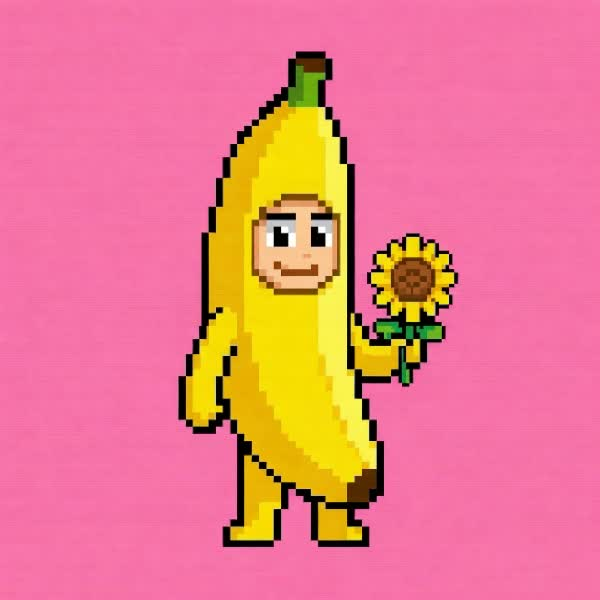
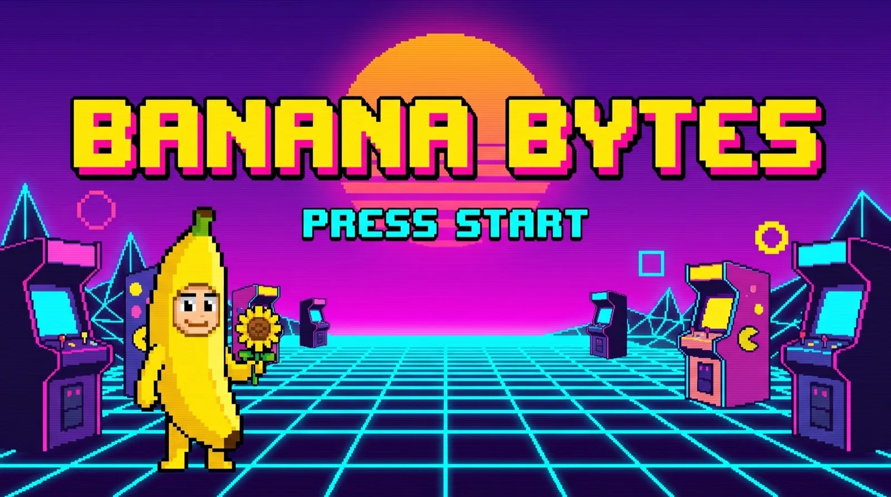

# Media Generation Log — Banana Bytes Connect

All media generated via the **Higgsfield MCP** (forge skill), per Zack's instruction "use our higgsfield skills, don't use our api."
Workspace: private · **Ultra plan** (generation effectively unlimited — credit figures below are `get_cost` equivalents; Ultra deducts ~0).
Source art: `IMG_3035.JPG` — Zack's pixel-art ServingBanana mascot (uploaded to Higgsfield as media `1ac8f3d0…`).

---

### #1 — mascot-idle-loop (Kling 3.0 · image→video) ✓ USED

- **Job**: `7a91173a-8fc6-4e52-ae25-72e59c4bad5a` | **Model**: `kling3_0` i2v, 5s, 1:1, sound off
- **Cost (get_cost)**: 10 credit-eq | **Result**: 960×960 h264, 121 frames
- **Slot**: the mascot brought to life — seamless boomerang loop (Arcade "live screen" + Living "portal")
- **Prompt**: "The pixel-art banana mascot gently comes to life… soft bob, slow blink, sunflower sways… preserve crisp 8-bit pixel style and flat hot-pink background… locked camera, seamless looping idle."
- **Claude review**: Use 9/10 · Accuracy 9/10 — pixel style fully preserved, clean idle. **Status: ✓** (web-encoded to boomerang mp4+webm @600, portal mp4 @480)

### #2 — char-render → char-render-cut (Nano Banana · image, ref mascot) ✓ USED

- **Job**: `420a1718-f39a-4caa-a072-1ab5cfcb4672` | **Model**: `nano_banana_2` @2K, 2:3, reference = mascot
- **Slot**: premium 3D-plush reimagining of the sprite → GLASS direction hero figure
- **Prompt**: "Reimagine this pixel-art mascot as a smooth modern 3D-render-ready plush character… keep exact design/identity… clean studio lighting, neutral gray seamless bg, full body."
- **Claude review**: Use 9/10 · Accuracy 9/10 — clean, premium, identity preserved. Background removed **locally** (PIL border flood-fill) → `char-render-cut.png`. **Status: ✓**

### #3 — arcade-hero (Nano Banana · image, ref mascot) ✓ USED

- **Job**: `453143b4-be9e-40c4-a6b0-f8fca9891349` | **Model**: `nano_banana_2` @2K, 16:9, reference = mascot
- **Slot**: ARCADE direction hero (baked scene) + the OG share card (`og.jpg`)
- **Prompt**: "Retro 8-bit pixel-art hero banner… mascot in a neon synthwave arcade world… chunky pixel title 'BANANA BYTES' banana-yellow w/ hot-pink shadow + 'PRESS START'… CRT scanlines, arcade cabinets, cyan grid."
- **Claude review**: Use 10/10 · Accuracy 10/10 — in-image text rendered perfectly. **Status: ✓**

### #4 — mascot.glb (Meshy · image→3D) ✓ USED
- **Job**: `b2495aaf-e7b8-4709-8d13-c091f73dec2d` | **Model**: `image_to_3d` (Meshy), textured, no rigging, from the pixel sprite
- **Cost (get_cost-eq)**: ~35 | **Result**: glTF 2.0 GLB, 6.2 MB
- **Slot**: the 2D-sprite-turned-3D model → 3D direction (model-viewer, scroll-spun)
- **Status: ✓** (kept the authentic sprite identity rather than smoothing first)

### #5 — video background removal (auxiliary) — superseded
- **Job**: `5b275ead-…` | **Model**: `video_background_remover` → clean matte but baked on **black**; the mascot's black pixel-outlines would key out. Superseded by a **local hot-pink chroma-key** (similarity 0.14) from the original loop → produced `mascot-alpha.mov` (true HEVC/hvc1 alpha, Safari) + `mascot-alpha-poster.png`.
- **Note**: this machine's ffmpeg `libvpx-vp9` will not emit VP9 alpha, so cross-browser transparent video was dropped in favor of the robust **circular live-portal** treatment in the Living direction.

### #6 — image background removal (char) — failed → done locally
- `remove_background(image)` returned **MCP connection lost**; recovered with a local PIL border flood-fill cutout. No cost.

---

## Totals
- Higgsfield jobs that generated assets: **4** (1 video, 2 images, 1 3D) + 2 bg-removals.
- Credit-equivalents ≈ 45 (video 10 + 3D 35 + images ~0–4 ea). **Ultra plan → ~0 deducted.** No legacy Grok/Gemini/OpenAI API used.
